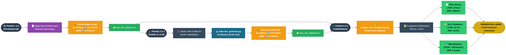

# Proactive Microservice Autoscaler using LSTM & KEDA

**Master's Thesis Project** | **Author:** Mahmoud Yousri

This repository contains the implementation of a proactive, machine-learning-based Horizontal Pod Autoscaler for Kubernetes. It utilizes a Long Short-Term Memory (LSTM) neural network and [KEDA](https://keda.sh/) (Kubernetes Event-driven Autoscaling) to predict microservice workloads and proactively scale replicas *before* a spike occurs, preventing SLO violations and latency degradation.

The system is tested against Google's [Online Boutique (Microservices Demo)](https://github.com/GoogleCloudPlatform/microservices-demo). The original Google README can be found [here](GOOGLE_README.md).

## 📊 Architecture & Methodology

### 1. Training & Evaluation Methodology
The LSTM model was trained on 6 hours of diurnal traffic patterns generated by Locust. The data was collected via Prometheus and processed into a time-series dataset.


### 2. Live Burst Comparison (LSTM vs. HPA)
A heavy burst of 800 concurrent users was simulated over 22 minutes to compare the standard Kubernetes HPA (Reactive) against our LSTM-KEDA model (Proactive).



## 🚀 Key Results
- **P95 Latency:** Reduced from `2902ms` (HPA) to `871ms` (LSTM).
- **SLO Violations:** Reduced from `42.6%` (HPA) to `19.7%` (LSTM).
- **Zero Downtime:** Proactive scaling ensured replicas were ready before the traffic hit.

## 🛠️ How to Run the Project

### 1. Prerequisites
- Kubernetes Cluster (GKE recommended)
- Istio Service Mesh
- Prometheus & KEDA installed
- Python 3.10+

### 2. Data Generation & Training Pipeline (Phase 1)
To generate the 6-hour diurnal traffic dataset and train the LSTM model from scratch:
```bash
# 1. Generate diurnal traffic and collect metrics (6 hours)
cd lstm_autoscaler/scripts/pipeline
python run_pipeline.py

# 2. Train the Global LSTM Regressor
cd ../ml
python train_lstm.py
```

### 3. Live Production Pipeline (Phase 2)
To run the proactive autoscaler AI daemon in the background:
```bash
cd lstm_autoscaler/scripts/live_production_daemon
python live_predictor.py
```

### 4. Running the Flash-Crowd Locust Test (Phase 3)
To simulate the 800-user burst pattern against the active AI daemon:
```bash
cd lstm_autoscaler/scripts/live_production_daemon
python run_master_pipeline.py
```

### 5. Generating the Comparison Dashboard
After collecting datasets from both HPA and LSTM experiments, run the analysis script to generate the final plots:
```bash
cd lstm_autoscaler/scripts/live_production_daemon
python analyze_live_comparison.py
```

---
*This project was developed as part of an MSc Software Engineering Graduation Project.*
